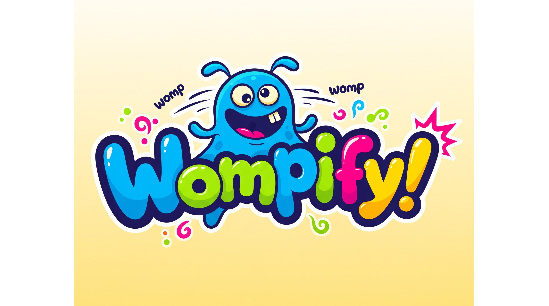

# Wompify

Replace every verb with “womp” — but make it tense-aware and case-matched. Chrome extension. Minimal. Mischievous. Womptastic.

- walked → womped
- RUNNING → WOMPING
- Run → Womp

## Why?

Because the internet is serious business. Wompify makes it less so. It’s a compact sandbox for DOM mutation, offline lexical mapping, and delightfully dumb linguistic mischief.

I first got the idea one day on the freeCodeCamp discord. The community manager started randomly "WOMP WOMP!"-ing in the general chat channel, and even changed the channel name to include "WOMP-WOMP". Many channel members "wompified" their display names as well. I'm always looking for a quick project to bang out that will teach me something new, and needed a break from my current project. Thus, Wompify was born.

## Features

- Tense-aware replacement:  
  Uses the composure library to determine which tense the verb is in, changing the verb to `womp`, `womped`, `womping`, `womps`, etc.

- Case preservation:  
  Keeps original case — ALL CAPS, Title Case, or lowercase.

- Styled and swappable:  
  Verbs are wrapped in underlined `` elements. Hover to reveal a tooltip with the original word.

  - Future versions will allow users to style the span element themselves with CSS from a settings modal.

- Sensible guardrails:  
  Local only, no fetch requests or logging.

- Manual activation (FUTURE):  
  Click the “WOMPIFY!” button that floats in the corner. Choice for no background script or auto-run.

## Install (Dev mode)

1. Clone this repo
2. Run: `npm i`
3. Build with Vite: `npm run build`
4. Go to `chrome://extensions` → Enable Dev Mode → “Load unpacked” → select base folder `dist/`

## Usage

- Navigate to any webpage
- Verbs get automatically womp womped.
- Hover any womped word to view a tooltip of the original word.

## Design choices

- Uses the composure library to determine verbs and verb tense.
- Replacements happen in the DOM via span injection; avoids breaking layout normally.
  - Note: Sometimes layouts depend on pseudo selectors, so changing text and inserting spans can still sometimes break layouts. I'm now only seeing this on github.com in my latest testing, but there may be more. Any tips or info is much appreciated!
- Offline-only. No tracking. All logic runs locally.

## Roadmap

- Adding a manual mode with a customizeable "Wompify this!" button.
  - Users will choose placement of the button (e.g. Top right, bottom left, etc.).
  - Users will be able to style the wompified text spans themselves with CSS directly from the settings modal.
  - Would like to also allow users to style the "Wompify This!" button themselves if they really want to get in the weeds.
- Womp‑O‑Meter slider (probabilistic replacement)
- Per‑site toggle and autosettings
- Optional keyboard shortcut
- Light/dark theme options

## Contributing

- Want to add more verbs? Extend `src/verbs.ts`
- Bug or idea? Open an issue or pull request
- Stay playful, stay lightweight

## License

MIT © Brandon Werner 2025

## A.I. Disclosure

Developed with assistance from Copilot
